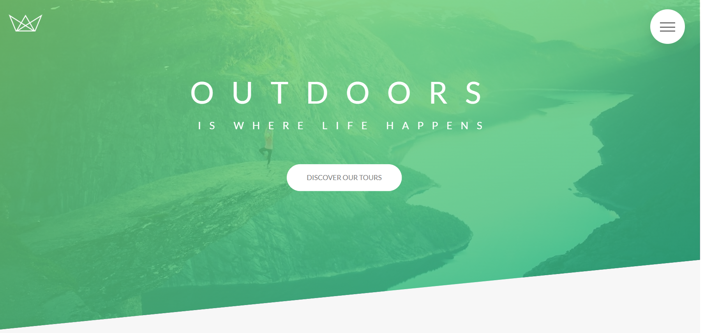

Company's webpage build with  modern CSS techniques and costum animations.

Users should be able to:

- View the optimal layout for each of the website's pages depending on their device's screen size
- See hover states for all interactive elements on the page
- View each page and be able to toggle between the tabs to see new information

### Screenshot

### Links

- Live Site URL: [https://natours-final-project.netlify.app/]

### Built with

- HTML
- CSS custom properties
- Sass

